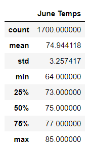
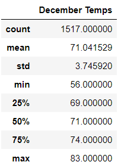
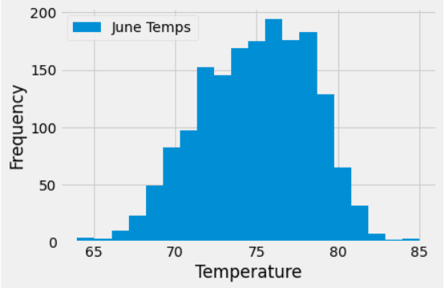
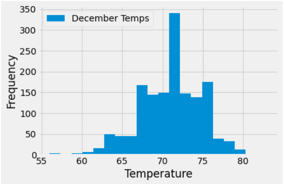
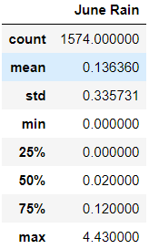
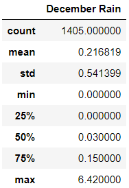

# surfs_up

## Overview
This project is to analyze weather data for Oahu, one of the islands in Hawaii, and determine if opening an surf and icecream shack in this island would be a profitable venture.

For our analysis we are specifically looking into reported June and December temperature trends to determine if the surf and ice cream shop business is sustainable year-round. 

The weather data is stored in a local database as [hawaii.sqlite](hawaii.sqlite). 

Instead of using direct SQL commands, SQLaclchemy is used to make connection to the SQLite database.

The analysis data is extracted into pandas dataframe and then 'Histogram' chart is created using matplotlib library.

[SurfsUp_Challenge.ipynb](SurfsUp_Challenge.ipynb) has all the code for data extraction and analysis.

## Results
The following data and graph were generated as part of the analysis:

**Summary of June and December Temperatures**

     

**Graphical Representation of June Temperature Trends**

 

**Graphical Representation of December Temperature Trends**

From the above figures, the following observations are made:
- The mean temperature in June (75F) is only 4 degrees higher than December mean temperature(71F).
- The middle 50 Percentile temperatures in June and December are consistent with mean temperature; i.e, June 50 percentile temperature (75F) is 4 degrees higher than December 50 percentile temperature (71F).
- Expectedly, the minium Decemeber temperature (56F) is 9 degrees colder than June temperature(64F). However, there is only 2 degrees of temperature difference between June maximum temperature (85F) and December maximum temperature (83F).
- Quarter of the December temperatures are below 70F.

## Summary
From the numbers and figures above, it shows that there is not much variability in the temperatures between June and December. Though there are some low temperature days in December, but mostly there are warmer days. 

**With the above observations, I would conclude that temperature would not be any risk factor for opening the surf and icecream shop in Oahu.**

As we also understand that Rain plays a big part in people coming out and enjoy surfing or eating icecream. So, I performed additional analysis of precipitation of June and December.

### Rain Data for June and December

  

From the above numbers we observe that the maximum recorded precipitation in June is 4.43 inches while it is 6.42 inches in December. However, there is not much difference in precipitation for most of the days (50 percentile) as June 50 percentile number is .02 inches while December is .03 inches. 

We see that there is not much variability in temperature and precipitation data between June and December. 

**Hence, it is safe to conclude that Oahu weather conditions are ideal for opening a year round surf and icecream shop.**
